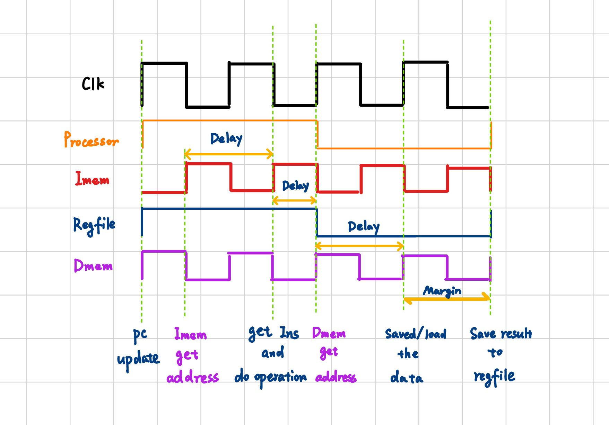

# Project: Simple MIPS Processor Design

**NetID:** yz845, yl954  **Name:** Yunfan Zhang, Yuanzhi Lou **Course:** ECE550D   **Date:** 25/10/2023

---

## Content

1. Processor Overview

2. Clock Configuration

3. Control Unit

4. Datapath and Processor

---

## 1. Processor Overview

**a) The overall files in this project checkpoint 4 include:**

- skeleton.v: Top design part, with Instruction memory, data memory, and Register file

- alu.v: a alu structure with plus, minus, shift, and, or operation and less, equal, and overflow sign

- regfile.v: a register file with 1 write port and 2 read ports

- processor.v: main datapath for the processor

- control.v: control signal for input

- imem.v: Instruction memory

- dmem.v: Data memory

- freqdiv.v: clock divider configuration

- pc.v: PC config

- dffe.v: file that contains 32 bit register

**b) The general structure of my top-level Regfile includes 3 parts:** 

- The skeleton that contains the regfile, instruction memory, data memory and the main datapath (processor).

- The control unit would control each mux, regfile, and dmem to maintain the correct operation for the processor

**c) Input and Output**

|**Port Name**|**Input/output**|**Description**|
|-|-|-|
|clock|Input|Source clock for all devices|
|reset|Input|Reset signal for clear all data|

**d) Procedure and Description**

My processor contains two ALUs, one regfile, and one Dmem and Imem, respectively. The PC would use one ALU to always plus 1 to get the next address in Imem. The Imem would output the 32-bit instruction according to the PC. One main ALU would do all the arithmetic operations and output the result. The Dmem and regfile would be used for saving the result and the data. 

Each instruction would take 4 clock cycles to proceed, the same as the regfile clock. The Imem would use a negative clock, while the Dmem would use the same input clock.

---

## 2. Clock Configuration

The processor would use Clock/4 clock frequency, for it is the clock for fetching the new instructions and PC, which should be the lowest. 

The regfile would be the same as the processor clock, for the data to be written into the register file should be the last thing from the processor. Thus, the regfile would only write once and should be the last one to update. 

The Imem would use ~Clock for its clock input, as it should wait for the PC to be stable for a half clock cycle and then fetch the instruction.

The Dmem should use the Clock for its clock input, as it should wait for a half-clock cycle for the ALU calculation and then store or load the data.

The timing detail is shown in the following picture:



```Verilog
clk_div4 pc_clk  (clock, reset, processor_clock);
assign regfile_clock = processor_clock;
assign imem_clock = ~clock;
assign dmem_clock = clock;
```

## 3. Control Unit

Our control unit would take the operation code, ALU operation code, and overflow signal from the output the control signal including Rwe, Rtar, Rwd, ALUinB, ALUopctrl, Ovfctrl, and DMwe. These signals would control the corresponding mux in the datapath and also the data memory write enable and regfile write enable.

The control unit would use the Random Logic method to proceed.

```Verilog
output Rwe, Rtar, Rwd;  // Register control flag
output ALUinB;          // ALU unit control flag  
output DMwe;            // Data Memory write control
output [1:0] Ovfctrl;   // Overflow control flag      
output [4:0] ALUopctrl; // ALU operation code 
```

## 4. Datapath and Processor

The whole processor is shown like this:


The mux at the target register is for sw operation, while the mux at the destination register is for overflow cases. The mux at the ALU operand B is for immediate instruction; the overflow would also control the data selection for ALU or 1, 2, and 3. The mux at the write data port in regfile is for lw operation.

